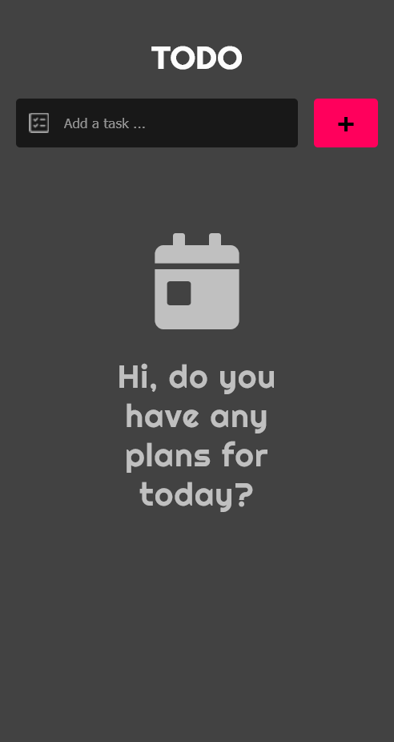
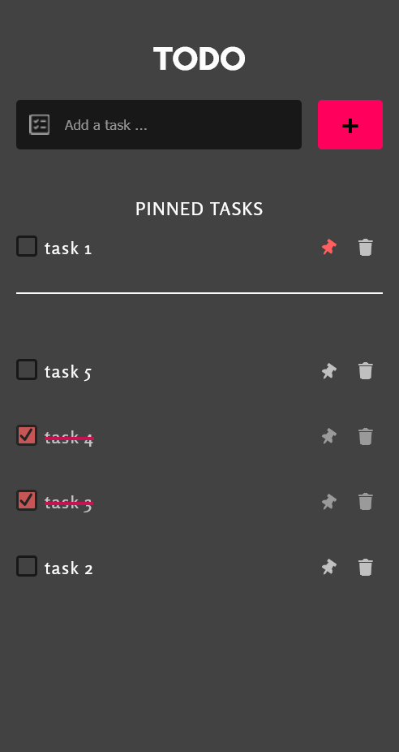

# todoList.js
## A vanilla javadcript todo-list app
> this is a friendly beginners project to practice your javascript skills

### this app includes :
- [x] An **input** to type your task
- [x] Add **button** to add new tasks
- [x] each task has : 
  - [x] **checkbox** square to check the completed tasks
  - [x] **Pin** element to pin the important tasks
  - [x] **Delete** element to delete a task
- [ ] storage feature to store tasks in the browser

> This is not a complete todo list app, It's just a small project to practice javascript basics (including DOM API)

### design and screenshots

***waiting for your opinions/issues reports/pull requests***

you could find me on [Twitter](http://twitter.com/CMarghin)
